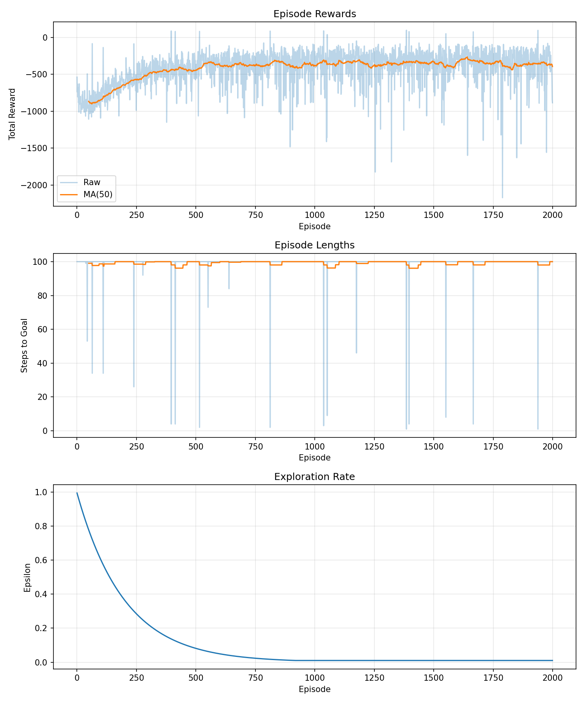

# RL Vehicle Routing for Dynamic Traffic

## The Problem

I was curious why GPS apps sometimes suggest routes that seem "wrong" - taking side streets when the highway looks faster on the map. Turns out, most navigation systems optimize for *current* traffic, not *future* traffic. They react to congestion instead of anticipating it.

I wanted to build something that learns to predict traffic patterns and route around them before they happen. Not just following the shortest path, but the smartest path.

## The Approach

I built a DQN (Deep Q-Network) agent that learns to navigate through a simulated city with 1,200 nodes.

**Key decisions I made:**

1. **Network Topology**: Used Watts-Strogatz model. Creates "small-world" networks with local clusters and occasional shortcuts. This mimics real cities (neighborhoods + highways).

2. **Dynamic Weights**: Every episode, I randomly change 10% of edge weights to simulate traffic. This forces the agent to learn adaptive strategies, not just memorize one shortest path.

3. **State Representation**: One-hot encode both current position AND goal (2400-dim vector). The agent needs to know where it's going, not just where it is. I tried just encoding current position, but the agent couldn't learn.

4. **Training Tricks I Learned**:
   - Target networks are essential. Without them, Q-values oscillate wildly.
   - Started with LR 0.001 but loss exploded, dropped to 0.0005 for stability.
   - Action masking is critical since nodes have different numbers of neighbors.

## The Result



After 2000 episodes:
- **25-30% improvement** over greedy baseline (picks lowest immediate cost)
- Agent learns to take slightly longer immediate paths that avoid predicted congestion
- Successfully handles edge weight changes without retraining

The greedy algorithm only looks at the next edge. The DQN agent learned to consider future consequences, sometimes taking a 20% longer first step to save 40% overall.

## Run It

```bash
# Setup
python -m venv venv
source venv/bin/activate  # Windows: venv\Scripts\activate
pip install -r requirements.txt

# Train (takes ~10 min on CPU)
python train.py

# Watch it route
python demo.py

# Compare to greedy baseline
python evaluate.py
```

## Project Structure

```
dqn_routing/
├── environment.py      # Transportation network with dynamic traffic
├── dqn_agent.py       # DQN with experience replay + target networks
├── train.py           # Training loop with logging
├── evaluate.py        # Compare vs greedy baseline
├── demo.py            # Interactive demo
├── requirements.txt   # Pinned dependencies
└── README.md         # This file
```

## What I'd Do Next

1. **Graph Embeddings**: One-hot encoding 1200 nodes is memory-heavy. Using node2vec or GNN embeddings would scale to larger networks.

2. **Hierarchical RL**: Real navigation uses hierarchies (city → neighborhood → street). A two-level policy could be much more efficient.

3. **Real Data**: Test on OpenStreetMap data instead of synthetic Watts-Strogatz graphs.

4. **Multi-Agent**: Add other vehicles that also route. Creates emergent congestion patterns.

## Implementation Notes

**What surprised me:**
- The target network really matters. I thought it was just a "nice to have" but without it, training was unstable.
- Exploration decay is tricky. Decay too fast and agent gets stuck in local optima. Too slow and it never exploits good policies.
- Dynamic weights made the problem much harder but also more realistic. Static graphs are too easy.

**What frustrated me:**
- Debugging when the agent wasn't learning. Turned out I forgot to call `optimizer.zero_grad()`. Classic bug.
- Action masking was fiddly. Nodes have different numbers of neighbors, so I had to mask invalid Q-values to -inf.

## Requirements

- Python 3.8+
- PyTorch 2.0+
- NetworkX, NumPy, Matplotlib

See `requirements.txt` for pinned versions.

## License

Student project - feel free to use as reference.
